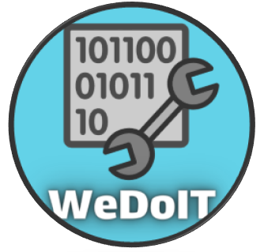

## STP ST21 Team D - WeDoIT

## Accord - Message Client
Accord is an Application developed by a small Team at the University of Kassel.

 
Designed for an optimal user experience while communication with others. 
Accord gives you the choice between writing text messages directly to your friends, or chatting in a joint server 
with everyone you choose to include at the same time. With the latest release we have also added the ability to talk 
to your friends in voice channels on any server you have joined.

## Features
- Login
    - Create a new account and login
    - Communicate with other users without an own account via guest access
- Server
    - Create new servers or delete old ones
    - Join and leave other servers or invite people to your servers
    - Chat in text channels
    - Speak with people in voice channels
    - Mute users in audio channels
    - Change the name of the server, channels and categories
    - Send private messages via a popup on the server screen
- Chats:
    - Chat with users who are online or in text channels
    - Send various media formats
    - Edit and delete messages in text channels
    - Mark users with **@** in messages
    - Style your messages with line breaks with [Shift] + [Enter]
    - Enter a server with an invitation link
    - Join a server you've been invited to in a private chat
    - Use Emojis
    - Get notified about new private messages
    - Copy messages to the system clip board
- Privat Chats:
    - Play Rock-Paper-Scissors against another user other
- Options:
    - Select a languages: English, German or Farsi
    - Choose between a dark or light theme
    - Get logged in automatically
    - Set the font size for chat messages
    - Logout from your account

## Last added
- New login screen and design
- Audio channels and audio channel options to mute users
- Integration of various media formats like mp4, gif and png integrated via links
- Editing and deleting of messages
- Sending private messages via a popup on the server screen
- Tagging users in server chats function
- Different languages to choose from
- Insertion of line breaks with [Shift] + [Enter]
- New colored style for emojis in chats
- Changing of the font size for chat messages
- Copying of messages to the clipboard

## Upcoming next Release
- More settings for audio channels
    - Input and Output selection
    - Adjusting the volume
    - Microphone test
- Integration of various services like Spotify and Steam
- No more main screen for choosing a server
- Many smaller changes

## Authors and acknowledgment

This project is under development as part of a university assignment concentrating on the usage of the agile 
developing framework called scrum.
 
The WeDoIT Team consists of a Product Owner, a Scrum Master and six Programmers changing roles for every release.

## Support
If there are any questions or concerns feel free to address us over GitHub or directly using the emails provided in 
the different users profiles.
We are looking forward to helping you.